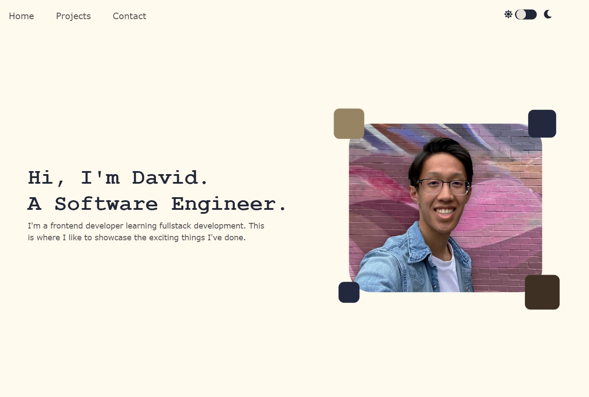

# Personal Website

A digital space to showcase my projects.



## Light/Dark Mode Toggle

> Inpsired by <a href="https://www.youtube.com/@slayingthedragon">this</a> video

The idea behind the light-mode and dark-mode toggle is to tie specific background-color and color values of HTML elements to variable names, such as "foreground", "background", or "accent". I can then modify these variables' HEX values to create colour themes in both light and dark. 

Using event listeners, I assign or remove the class "dark-mode" to the ``<body>`` element in HTML when the button element is pressed. Then, a CSS block assigned to this "dark mode" tag changes the HEX values for all the colour variables. 

```css
/*Base colours*/
:root {
  --clr-fore: #212736;
  --clr-back: #fff9ee;
  --clr-fore2: #534e50;
  --clr-back2:#e8e3da;
  --clr-foot: #212736;
  --clr-foot2: #fff9ee;
  --clr-but: #444f6b;
}

/*Dark colours*/
.dark-mode {
  --clr-back: #1f1f29;
  --clr-fore: #cfccc8;
  --clr-back2: #13131b;
  --clr-fore2:#d9d6ce;
  --clr-foot: #1f1f20;
  --clr-foot2: #fff9ee;
  --clr-but: #a5a5a5;
}
```

To keep the dark-mode toggle across multiple static pages, I set a variable in the local storage: 

```js
localStorage.setItem("darkMode", "true");
```

When the page loads, it checks the local storage for the presence of this dark-mode flag and assigns the "dark-mode" tag to the ``<body>`` element if this flag exists. If the toggle is ever set off, these tags are removed from the ``<body>`` element and the local storage. 

```js
const isDarkMode = localStorage.getItem("darkMode") === "true";
toggle.checked = isDarkMode;

if (isDarkMode) {
  body.classList.add("dark-mode");
}
```

## Where to View

The website can be found <a href="//davidtam.me">here</a>.
